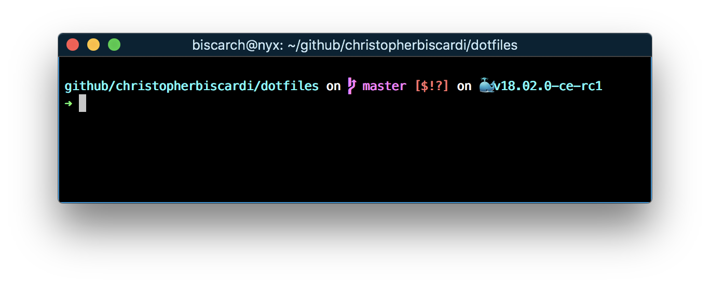
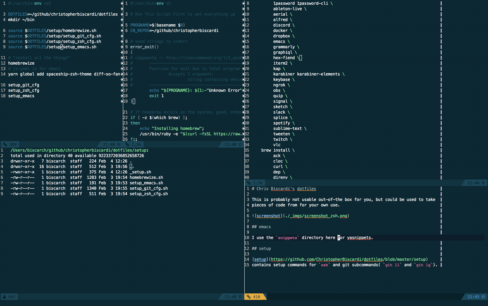

# Chris Biscardi's dotfiles

This is probably not usable out-of-the box for you, but could be used to take
pieces of code from for your own use.

## emacs

I use the `snippets` directory here for yasnippets.

## Install

Get the
[bootstrap](https://github.com/ChristopherBiscardi/dotfiles/blob/master/bootstrap.sh)
file and run it locally.
